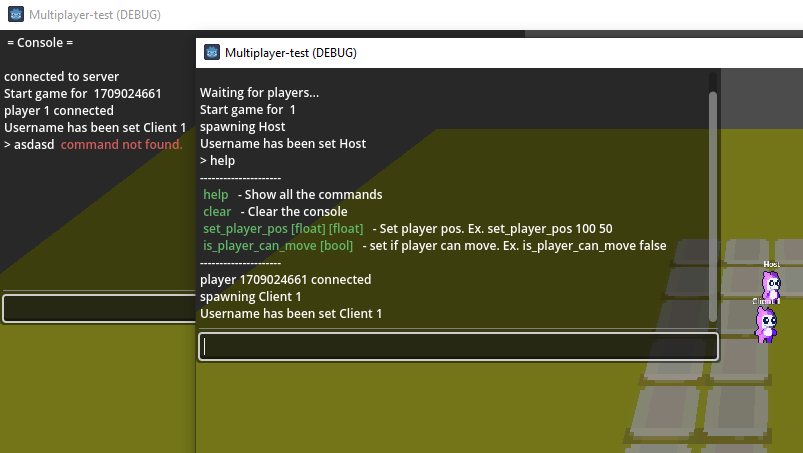

# Dev Console for Godot 4.2.x

Hey there! Check out this handy in-game dev console I made for Godot. It's super easy to set up and perfect for debugging multiplayer games.

You know how the built-in console kinda jumbles everything together? Well, mine separates the console outputs for each instance, making multiplayer debugging way easier.

Give it a try and see how much smoother your development process can be!




## Features

- Simple setup and usage
- Print anything in console using Console.print()
- Define custom commands for your game
- Navigate previous commands with ease using the arrow keys
- Toggle the console with the press of the `~` key

## Installation

* Add the repo as a submodule anywhere in your project

```bash
  git submodule add git@github.com:rootKot/godot4-dev-console.git
```
Now you will have `Console.tscn` in that `godot4-dev-console` folder
* Drag and drop the `Console.tscn` inside your scene node.
From the inspector you can set is the console should be visible by default when runing the project

## Usage

* Use `~` key to open/close the console (It is actually ` key)
* Type `help` and press Enter, to see available commands
* For printing something in the console use Console.print() instead of print()
```gdscript
  Console.print('Hello world')
  Console.print('This is my variable', my_variable)
  Console.print('I', 'can', 'pass', 'up', 'to', 12, 'params')
```

## Add custom commands
```gdscript
	Console.add_command(
		command_name: String,
		function: Callable,
		function_arguments_if_needed: Array[String],
		description_to_show_in_help: String
	)
```
### Examples
```gdscript
	Console.add_command(
		'set_player_pos',
		_set_player_pos,
		['float', 'float'],
		'Set player pos. Ex. set_player_pos 100 50'
	)
	func _set_player_pos(x: float, y: float):
		position = Vector2(x, y)
```
```gdscript
	Console.add_command(
		'is_player_can_move',
		func(val: bool): _is_player_can_move = val,
		['bool'],
		'set if player can move. Ex. is_player_can_move false'
	)
```
### Remove command
```gdscript
	Console.remove_command('is_player_can_move')
```

## Future plans
* Implement Autocomplete functionality
* Add checkbox to select if the console should be available in release build

## License
### MIT License
Copyright © 2024 rootKot
